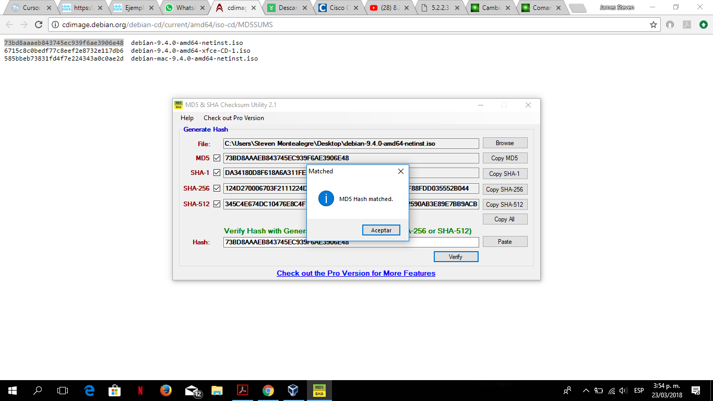
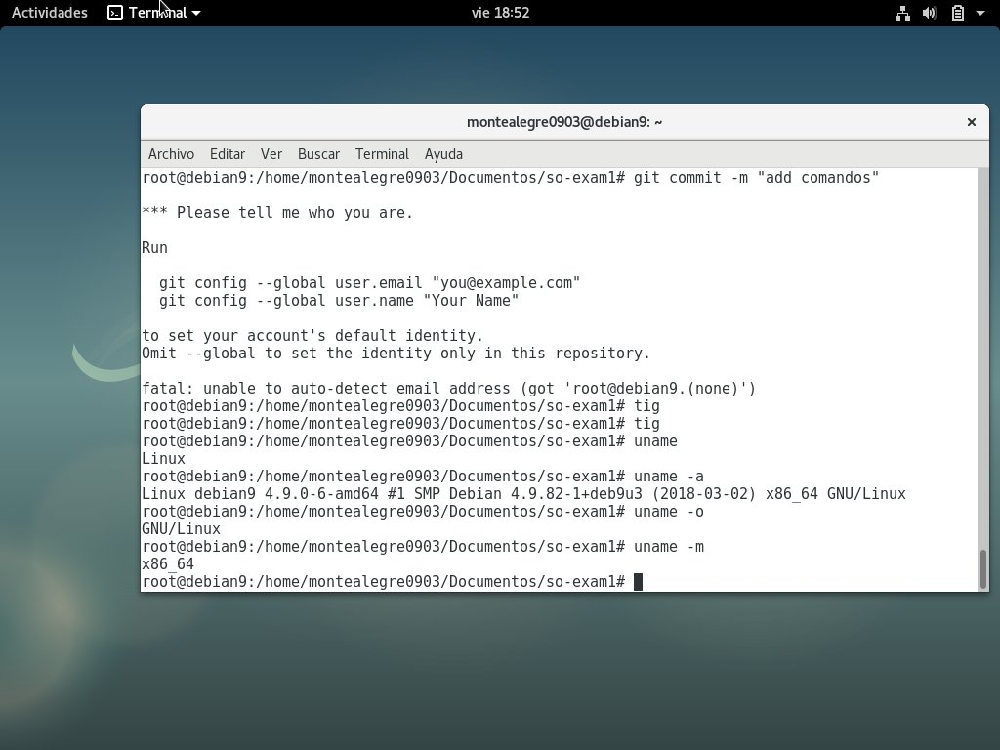
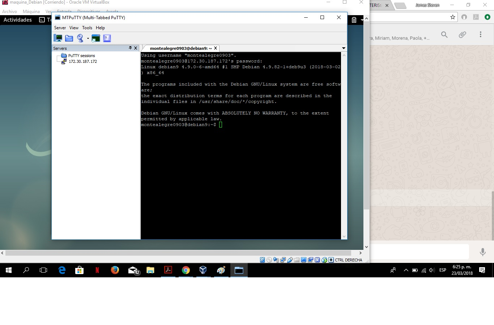
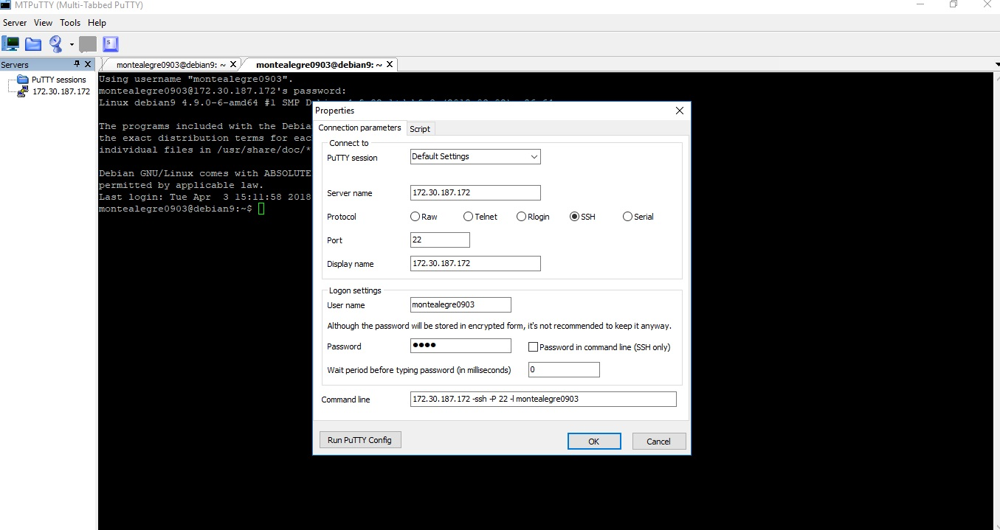
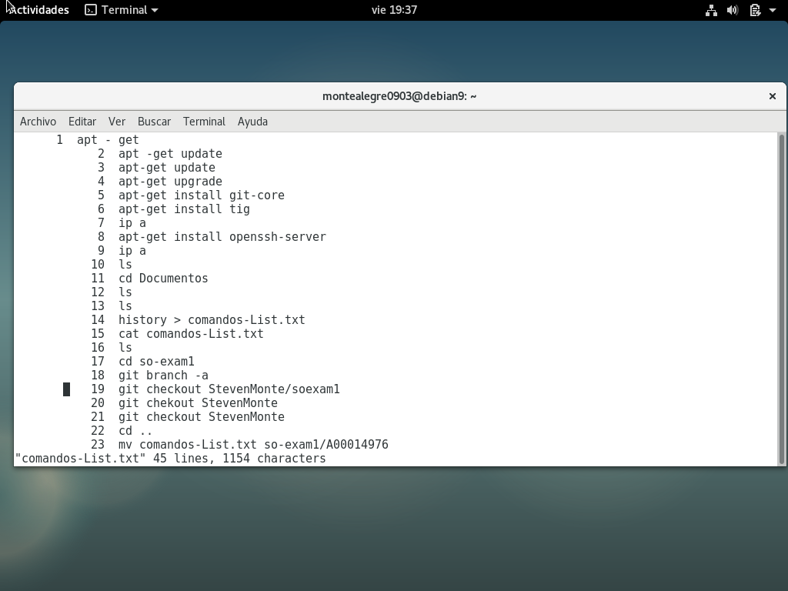

### Examen parcial #1
### Nombre: James Steven Montealegre Gutiérrez
### Código: A00014976
### url github: https://github.com/StevenMontealegre/so-exam1.git

### 3. VALIDACIÓN DE LA IMAGEN LINUX DEBIAN9
La imagen del SO fue descargada de la siguiente URL: https://www.debian.org/distrib/netinst#smallcd. Con la imagen en el computador, nos
dirigimos a la siguiente URL: http://download.cnet.com/MD5-SHA-Checksum-Utility/3001-2092_4-10911445.html con el fin de descargar
el programa que  permite validar la autenticidad de la imagen. Con el MD5 instalado, cargamos la imagen Debian y copiamos el
siguiente código de verificación: 73bd8aaaeb843745ec939f6ae3906e48. Si la respuesta es correcta (que fue mi caso) garantizamos
que la imagén es fiable, entonces procedemos a la instalación.

### 4. SECUENCIA DE PASOS PARA LA INSTALACIÓN DE LA IMAGEN DEL SO
Para instalar la máquina virtual que corre Debian9 ingresé a VirtualBox, cree una nueva máquina linux64, Debian. Asignamos los recursos
necesarios para correr la máquina, Almacenamiento, memoria RAM, disco duro. Seguido damos iniciar.
Cuando hemos finalizado las primeras configuraciones, ingresamos a almacenamiento y cargamos la imagen de Debian que habíamos descargado.
A continuación configuramos las tarjetas de red, conservamos el NAT, y asignamos un adaptador de puente. Terminado esto, damos clic en
iniciar. Durante este proceso debemos instalar la configuración gráfica, seleccionamos un idioma, asignamos clave y usuarios. Finalmente
damos click en continuar.

``~uname a`` : Presenta información sobre el sistema operativo.  
``~uname m`` : Indica el tipo de arquitectura del procesador.  
``~uname o`` : Indica el sistema operativo.  
### 5. CONFIGURACIÓN DE LA INTERFAZ DE RED Y CONEXIÓN CON PUTTY  
Para llevar a cabo la comunicación de la máquina virtual con MTPutty debemos configurar  primeramente en la máquina las interfaces de red (adaptador de puente), seguido, ejecutamos MTPutty, ingresamos la ip de nuestra máquina virtual (para conocer esta, en la terminal escribimos el comando ``ip a``), el username, la clave de nuestra máquina y damos aceptar. Si la conexión no logra establecerse entre la máquina y el MTPutty se recomienda en la terminal de la máquina ingresar el siguiente comando: ``apt-get install openssh-server``

### 6. INSTALACIÓN DE TIG && GIT  
Cambiamos de usuario a root, seguido ejecutamos los comandos:  
``apt-get update``    
``apt-get install tig``    
Podemos observarlo más en detalle en la imagen acontinuación:    
  
Historial de commints que 

## 7. 

###8. CUADRO COMPARATIVO ENTRE CENTOS7 - DEBIAN9
